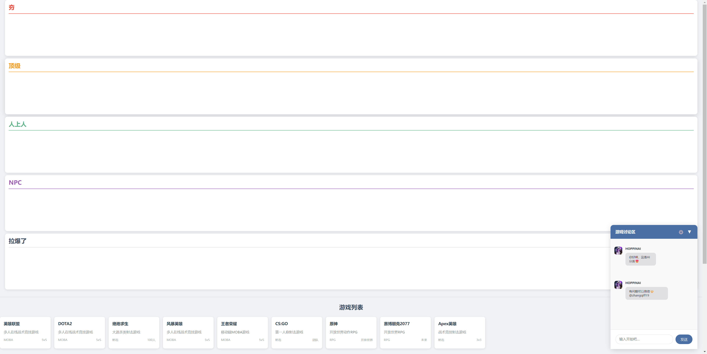

# AI应用之——从夯到拉

纯提示词驱动，运行game-sorter.html即可

## 关于提示词

DOTA2和LOL的提示词都是AI生成的，借助提示词和json_object，显式要求AI返回json来进行工具调用。  

从夯到拉的提示词是我仿照CherryStudio写的，借助提示词，显式要求AI返回xml来进行工具调用。  

从夯到拉的提示词是字符串模板，注意动态参数和占位字符串!  

## 演示
https://www.bilibili.com/video/BV1wAyZBkEu9/

